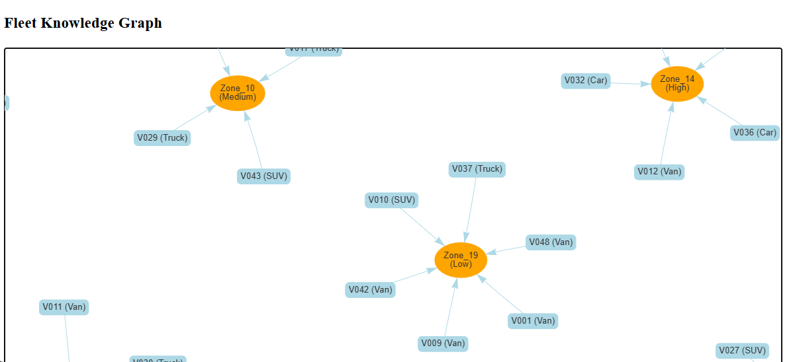
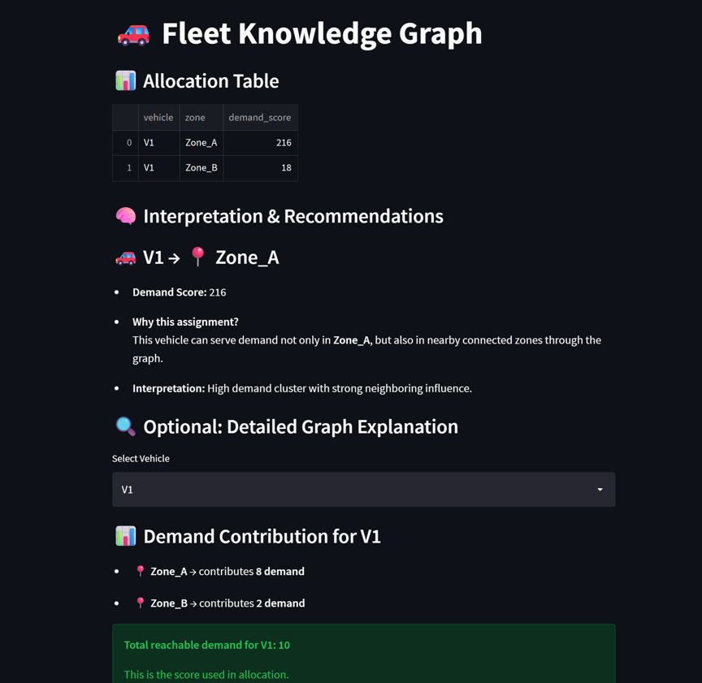

# Fleet-Knowledge-Graph_1

Wwe make with streamlit Fleet Knowledge Graph for Demand-Aware Vehicle Allocation  - it is  relevant for logistics, mobility platforms, and even EV fleet optimization. We do structure it so we can actually build a working Streamlit app + knowledge graph backend.

## 🧠 Concept: Fleet Knowledge Graph (FKG)

We are building a graph where:

- Nodes
- Vehicles (ID, type, capacity, location, status)
- Locations (depots, demand zones)
- Trips / Orders
- Time windows
- Demand clusters
- Edges
- LOCATED_AT
- SERVES
- ASSIGNED_TO
- NEAR
- PREDICTED_DEMAND

This lets you answer questions like:

- “Which vehicles should be reallocated right now?”
- “Where will demand spike in 30 min?”
 - “Which idle vehicles are closest to high-demand zones?”
  
##⚙️ Stack

- Frontend: Streamlit
- Graph: Neo4j
- Data: Pandas / synthetic or real fleet data
- ML: demand prediction (LSTM / XGBoost)

## 🏗️ Architecture
``` markdown
Streamlit UI
   ↓
Backend (Python)
   ↓
Graph DB (Neo4j)
   ↓
Demand Model (several choices)
```
# IMPORTANT  - Why do we need Neo4j here?
## 2️⃣ What Neo4j gives us

With a Knowledge Graph, we can:

- Benefit	How it works
- Multi-hop reasoning	“Zone A demand affects Zone B → Zone C.”
- Influence-aware allocation	“Send vehicle to a zone that will maximize coverage of predicted demand.”
- Real-time dynamic updates	Vehicles move → graph updates → next allocation recalculated.
- Explainable decisions	Trace why a vehicle was assigned: demand, neighbors, events.


Example

### Without graph:

Vehicle V1 → send to highest demand zone only

### With Neo4j graph:

Vehicle V1 → send to Zone_A because:
   - Zone_A demand = 10
   - Neighbor zones B & C sum = 15
   - Concert event in Zone_B will increase demand in 30 mins
   - Vehicle capacity & battery are sufficient

✅ This is much smarter, predictive, and explainable.

---

✅ We generate 
- vehicles.csv → 50 vehicles, realistic lat/lon, battery, status
- zones.csv → 20 zones, regions, priorities
- demand.csv → 600 rows (20 zones × 30 timestamps), current + predicted demand, events
- edges.csv → Neo4j-ready: NEAR relationships + vehicle locations


✅ What this gives us:
- vehicles.csv → 50 vehicles, realistic lat/lon, battery, status
- zones.csv → 20 zones, regions, priorities
- demand.csv → 600 rows (20 zones × 30 timestamps), current + predicted demand, events
- edges.csv → Neo4j-ready: NEAR relationships + vehicle locations

## 🧩 Why Neo4j becomes necessary

Because your system now includes:

1. Spatial relationships (not just coordinates)
Zones connected via NEAR, CONNECTED_TO, TRAFFIC_FLOW

2. Temporal relationships
Demand evolving over time
“NEXT_30_MIN”, “PEAK_PATTERN”

3. Multi-hop influence
Zone A → affects Zone B → affects Zone C

## 👉 This is hard in Pandas, natural in graphs.

---
Nodes
(:Vehicle {id, type, capacity, battery, status})
(:Zone {id, lat, lon})
(:Demand {level, timestamp})
(:Event {type, time})   # concert, rain, etc.
Relationship
(Vehicle)-[:LOCATED_AT]->(Zone)
(Zone)-[:NEAR {distance}]->(Zone)
(Zone)-[:HAS_DEMAND]->(Demand)
(Zone)-[:AFFECTED_BY]->(Event)
(Demand)-[:TREND]->(Demand)

1. Multi-hop demand propagation
MATCH (v:Vehicle)-[:LOCATED_AT]->(z1)
MATCH (z1)-[:NEAR*1..2]->(z2)-[:HAS_DEMAND]->(d)
WHERE v.status = 'idle'
RETURN v.id, z2.id, SUM(d.level) AS demand_score
ORDER BY demand_score DESC

2. Influence-aware allocation

Example:

Concert in Zone A
Demand spreads outward
MATCH (e:Event)-[:IMPACTS]->(z:Zone)
MATCH (z)-[:NEAR*1..3]->(neighbor)
RETURN neighbor, COUNT(*) AS influence

👉 You allocate BEFORE demand spikes.

3. Path-based routing logic
MATCH p = shortestPath(
  (v:Vehicle)-[:NEAR*..5]->(z:Zone)
)
RETURN p

👉 Not just distance—graph-aware routing

4. Explainability (huge advantage)

Neo4j lets you say:

👉 “Vehicle V1 was sent because:

Zone A demand = 8
Neighbor zones sum = 15
Event impact detected”

---

## 📸 Partial Fleet Graph Visualization


## 📸 Dashboard Visualization



